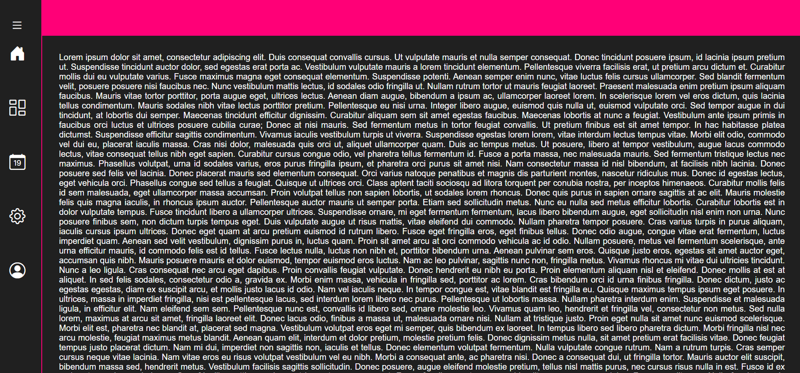

# menu-lateral
Criação de menu lateral duma dum homepage

### Desenvolvimento de homepage com efeitos, usando Html5, css5 e Javascript para interação dinâmica da mesma

## Tecnologias utilizadas: HTML, CSS e JAVASCRIPT

Link do hoomepage: 
